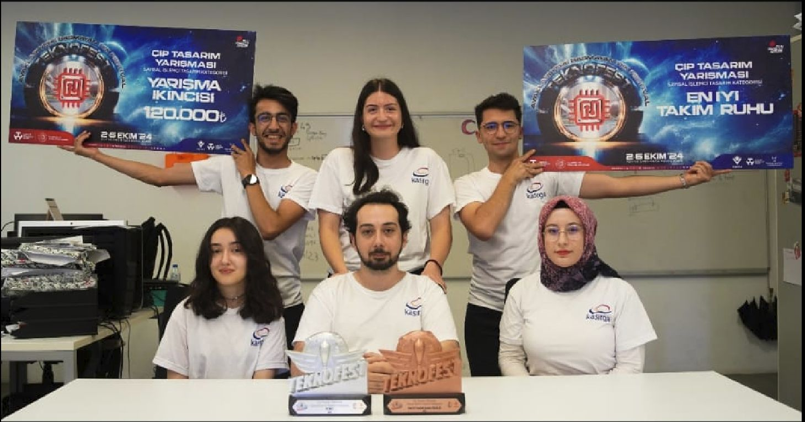

# ⚡ Kasırga ATEŞ  Digital Processor Design

Kasırga ATEŞ is a **digital processor design project** developed in **Verilog** under the **Kasırga Microprocessors Laboratory (TOBB ETÜ)**.  
The project focuses on building a high-performance, pipelined RISC-V–inspired processor architecture, optimized for efficiency and tested in competitive real-world scenarios.

This repository contains the processor implementation, memory modules, pipeline logic, and testbench infrastructure used in the **TEKNOFEST 2024 Digital Processor Design Competition**.

---

## 📂 Project Structure

- **`base_pipeline/`** – Core multi-stage pipeline implementation  
- **`memory/`** – Memory components and data management modules  
- **`pipeline/`** – Pipeline units and hazard handling  
- **`sources/`** – Source files for the architecture design  
- **`test/`** – Testbenches and simulation utilities  
- **`.vscode/`** – Development environment configurations  
- **`.gitignore`** – Git ignore rules
  
---

## ✨ Key Features

- 🖥️ **Custom RISC-V–inspired processor architecture**  
- ⚡ **Multi-stage pipelined execution** with hazard detection and resolution  
- 🔄 **Modular design** for extensibility and optimization  
- 🧪 **Testbench support** with simulation infrastructure  
- 🎯 Focused on **performance, efficiency, and scalability**  

---

## 🏆 Achievements

- **TEKNOFEST 2024 – Digital Processor Design Category**  
  🥈 *2nd Place Nationally* for advanced processor architecture design and optimization  
  *Institution:* TÜBİTAK | The Scientific and Technological Research Council of Türkiye  
  *Date:* 05/09/2024  

- **TEKNOFEST 2024 – Best Team Spirit Award**  
  🏅 Recognized for outstanding teamwork, collaboration, and resilience  
  *Institution:* TÜBİTAK | The Scientific and Technological Research Council of Türkiye  
  *Date:* 05/09/2024

  👉 [Read our announcement on LinkedIn](https://www.linkedin.com/feed/update/urn:li:activity:7331327321959809026/)

---

## 👥 Team

This achievement wouldn't have been possible without the dedication and expertise of our amazing team:  

- **Oruç Çakır** – Team Leader  
- **Zeynep Yavuz**  
- **Sena Filiz**  
- **Betül Aydeğer**  
- **Batuhan Uzunoğlu**

---

## 🙏 Acknowledgements

Special thanks to:  
- **TEKNOFEST** for hosting the national competition  
- **TÜBİTAK** for recognition and support  
- **TOBB ETÜ Kasırga Microprocessors Laboratory** for mentorship and resources
